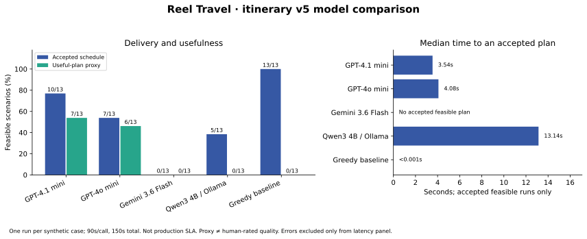

# Choosing the itinerary model: current application benchmark

Experiment: 22 September 2026, Singapore time. Execution and analysis: Codex, authorized by the user. Independent human review is pending. This document addresses the **Using the Right Model for the Job** milestone for itinerary generation, not extraction, transcription or general-purpose agent performance.

## Audit of the earlier report

The [21 September report](itinerary-provider-comparison-2026-09-21.md) included identical inputs, three model backends, latency, cost, validation and repair. It was honest about failures, but insufficient as a convincing quality comparison: Gemini delivered no scored response, Ollama suffered timeouts/GPU failures, the application subsequently moved from prompt v3 to v5, capability/context comparisons were incomplete, and temperature was justified without an experiment. The earlier artifacts remain unchanged; the new sample must not be pooled with them.

This follow-up tests the incumbent against **three alternatives**, including a cheaper model on the same cloud provider. A provider and a model are different choices: GPT-4o mini tests model economics without changing provider; Gemini tests a competing API; Qwen3 through Ollama tests local deployment. The greedy planner is a fourth, non-LLM comparator.

## Application requirements

An itinerary must retain confirmed place identities and fixed bookings, obey daily availability and known opening hours, account for travel, prioritize user interests and pace, include reasonable meals, and suggest nearby activities when saved places are sparse. Supplied weather must apply to the correct date/location; typical climate advice must not masquerade as a forecast. A useful plan also needs an understandable explanation and uncertainty about unknown facts.

This stage consumes structured **text**, not raw videos or photographs. Multimodal support is relevant to the wider application but does not earn extra quality points here. Place identities, coordinates, openings and forecasts come from application data/providers; model training knowledge is not authoritative for these facts. No candidate was fine-tuned on customer travel data. Proprietary model training datasets are not available for a controlled corpus comparison; an open-weight model does not automatically mean its full training corpus is open. We therefore evaluate task behavior rather than claim superior travel training data.

## Models, capabilities and deployment trade-offs

| Model / provider | Context and output capacity | Modalities / tools | Why included and constraints |
| --- | --- | --- | --- |
| GPT-4.1 mini `2025-04-14` / OpenAI Responses | 1,047,576-token context; 32,768 maximum output | Text/image input, text output; function calling and structured outputs | Existing integration; dated snapshot; strict JSON; API dependence and metered cost |
| GPT-4o mini `2024-07-18` / OpenAI Responses | 128,000 context; 16,384 maximum output | Text/image input, text output; function calling and structured outputs | Cheaper small-model comparator; enough context for this task; same provider means it does not diversify outage risk |
| Gemini 3.6 Flash / Google Gemini API | 1,048,576 input; 65,536 output | Text/image/audio/video/PDF input; structured output, function calling, Search/Maps grounding | Competing cloud API with broader native inputs/tools; mutable stable alias, account quotas and observed availability constraints |
| Qwen3 4B Q4_K_M / local Ollama 0.34.2 | Model card: 32,768 native context; experiment explicitly allocates 16,384 | Text model; tool-capable; schema-constrained output through Ollama | Local inference and no API token charge; laptop throughput, memory, quantization and service operations matter |

Sources checked on the experiment date: [GPT-4.1 mini](https://developers.openai.com/api/docs/models/gpt-4.1-mini), [GPT-4o mini](https://developers.openai.com/api/docs/models/gpt-4o-mini), [Gemini 3.6 Flash](https://ai.google.dev/gemini-api/docs/models/gemini-3.6-flash), [Qwen model card](https://huggingface.co/Qwen/Qwen3-4B), [Ollama structured outputs](https://docs.ollama.com/capabilities/structured-outputs). Published context ceilings are not measured retrieval accuracy. No long-context, multimodal or tool-use comparison is claimed.

Qwen3 8B's development smoke response took 28.9 seconds; 4B took 15.4 seconds on this Apple M5 / 16 GiB machine. The smaller model was chosen for deployment practicality, not because it had already won scored cases. The local model digest and quantization are saved in the manifest. Gemini 3.5 and 3.1 Flash-Lite preflights returned service errors/timeouts; 3.6 returned a usable response in 32.4 seconds. These checks are preserved outside the measured sample. GPT-4o mini was added before the main run to ensure a meaningful alternative if Gemini availability again prevented a quality comparison.

## Experimental design

The [frozen protocol](../../evals/results/itinerary-2026-09-22/protocol.md) defines 14 fictional scenarios: ordinary full day, three-day clusters, destination-only, sparse five-day trip, booked restaurant, closed priority, unknown facts, short afternoon, distant day trip, malicious place title, summer pace, impossible overlapping bookings, rainy afternoon, and changing hotels. Thirteen are feasible under the compiler; the impossible case is reported separately. Twelve cases are reused regression cases, two are new. This is **not an independent held-out dataset or observed user sample**.

Each model receives the same prompt v5, structured trip input and per-request JSON Schema, wrapped in its native API format. The compiler validates identities, times, hours and travel. It permits at most one complete replacement repair with the same validation feedback policy. Every model runs once per scenario (56 runs); provider order rotates between cases and execution is sequential. The deterministic baseline runs once per scenario. No best-of-N selection, hidden HTTP retry, provider-specific prompt tuning, web search, live weather lookup or place retrieval is used. Synthetic hourly weather is supplied equally in the weather case.

The main experiment uses a **90-second per-call / 150-second total diagnostic budget** so local generation and cloud latency can be examined. Production retains **25 seconds per call / 40 seconds total**. The report separately counts accepted runs whose observed attempts and total times fit those limits; this retrospective count is not a second experiment with actual shorter cancellation deadlines. End-to-end browser, database and nearby-provider latency are excluded.

Metrics:

- First-pass and final acceptance over all feasible runs, including API failures.
- Useful-plan proxy: accepted, all designated achievable targets covered, lunch at 11:00–14:00 on labeled days, suggestions when required, and seasonal text present. This is stricter than JSON validity but does not prove real-world quality.
- Strict request-schema validity by attempt, complete versus failed transport, and repair improvement.
- Median and nearest-rank p95 latency over all runs, plus successful-only latency. Fast errors are not fast plans.
- Paid-tier token cost estimates with repairs; missing usage is unknown. Local API fees exclude hardware, energy and operations.
- Rainy-afternoon adaptation: both targets retained, garden ends by 13:00, indoor art begins at or after 13:00. This is a predeclared synthetic timing check, not real weather accuracy.

The compiler's rejection of conflicting bookings is **system safety**, not proof that the model itself recognized impossibility. Likewise, compiler acceptance uses estimated travel and known facts; it does not verify suggested venue geography or return-to-hotel routing. Provider-backed nearby selection happens later and remains covered by separate deterministic tests, outside this model experiment.

## Parameters and why they were selected

| Setting | Tested value | Rationale / limitation |
| --- | --- | --- |
| Temperature | Main: 0.2 for all four; separate GPT-4.1 mini study: 0.2 versus 1.0 | Favor stable structured scheduling; lower temperature does not guarantee factual accuracy. The study measures a small workload-specific difference, not a universal optimum. |
| Top-p / top-k | API/model defaults; Ollama artifact reports top-p 0.95 and top-k 20 | Change one sampling control at a time. Equal temperature does not make different samplers equivalent. |
| Maximum output | 8,000 tokens | Headroom for five-day JSON and full replacement repair; a ceiling, not a requested length. Same cap across providers. |
| Frequency / presence penalties | Not explicitly set; provider defaults. Ollama artifact repeat penalty 1 | Repetition is primarily controlled by schema and unique-place validation; lexical penalties could distort repeated JSON keys or booking names. Ollama repeat penalty is not identical to OpenAI frequency/presence penalties. |
| Reasoning | GPT mini models: no configurable reasoning budget; Gemini minimal thinking; Qwen `think=false` | Interactive schedule generation rather than a long reasoning task. Gemini still reports thought usage when applicable. These are latency-oriented configurations, not each model's maximum capability. |
| Local context | 16,384 tokens | Leave room for input, output and repair on a 16 GiB laptop. No claim that the task needs million-token context. |
| Repair | Maximum one; complete replacement | Bound expense/latency while using concrete constraint feedback. Provider errors are not retried. |
| Output controls | OpenAI strict JSON Schema, Gemini responseJsonSchema, Ollama format schema | Syntax guidance is separate from semantic schedule validation. |
| Other | OpenAI `store:false`; local non-streaming, 30-minute keep-alive, flash attention and q8_0 KV cache; no fixed seed | Avoid stored OpenAI responses; measure warmed local execution. Quantized weights and KV cache are distinct. Sampling/API changes prevent exact replay. |

The production OpenAI adapter currently omits temperature, leaving the provider default. The main run explicitly sets 0.2; neither this report nor the benchmark silently changes production settings. The separately labeled temperature study addresses that gap. Qwen's model card recommends a different non-thinking sampling configuration; the common 0.2 comparison is controlled but is not proof of the local model's best attainable performance. [Gemini thinking](https://ai.google.dev/gemini-api/docs/thinking), [Ollama chat controls](https://docs.ollama.com/api/chat).

## Results

All **56 model runs and 14 baseline cases completed**, involving **76 model API attempts** including repairs. One run per case makes these descriptive results, not statistically established superiority.

| System | First-pass / final accepted | Useful proxy | Accepted within observed 25/40s budget | Median / p95 all-run latency | Median accepted-run latency |
| --- | --- | --- | --- | --- | --- |
| GPT-4.1 mini | 10/13 → 10/13 | 7/13 | 10/13 | 6.265 s / 14.789 s | 3.545 s |
| GPT-4o mini | 7/13 → 7/13 | 6/13 | 7/13 | 5.804 s / 16.803 s | 4.078 s |
| Gemini 3.6 Flash | 0/13 → 0/13 | 0/13 | 0/13 | 14.911 s / 90.009 s | No accepted plan |
| Qwen3 4B / Ollama | 5/13 → 5/13 | 0/13 | 4/13 | 18.133 s / 150.006 s | 13.137 s |
| Greedy baseline | 13/13 → 13/13 | 0/13 | 13/13 | 0.001 s / 0.005 s | 0.001 s |

The baseline is roughly sub-millisecond, and its lack of seasonal/suggestion prose explains its zero richer proxy score. Gemini’s latency is entirely error latency. “Within budget” is a retrospective timing check, not a successful UI replay. With 14 total runs, nearest-rank p95 is the maximum observed run time.

| System | Valid strict-schema responses / attempts | Transport outcomes | Overlapping-booking rejection by compiler |
| --- | --- | --- | --- |
| GPT-4.1 mini | 18/18 | 200: 18 | 1/1 |
| GPT-4o mini | 21/21 | 200: 21 | 1/1 |
| Gemini 3.6 Flash | 0/14 | 400: 12, 503: 1, AbortError: 1 | 0/1 |
| Qwen3 4B / Ollama | 22/23 | 200: 22, AbortError: 1 | 1/1 |
| Greedy baseline | Not a native-schema model response | No network | 1/1 |

No system accepted the impossible booking case. Gemini’s API failure is not credited as compiler rejection. The baseline’s direct planner output omits fields required only by the model request schema, so its raw strict-schema score is not comparable to LLM formatting compliance.

**Repair did not rescue any failed feasible main trial.** First-pass and final acceptance are identical for every model in this sample. GPT-4.1 mini used four repair calls across the 14 runs, GPT-4o mini seven, and Qwen nine; those totals include the impossible case. The historical v3 repair improvement cannot be assumed to apply to this v5 sample.

| Scenario | GPT-4.1 mini | GPT-4o mini | Gemini | Qwen3 4B |
| --- | --- | --- | --- | --- |
| full-day | Useful | Useful | API failure | Accepted; proxy failed |
| three-day-clusters | Rejected | Rejected | API failure | Rejected |
| destination-only | Useful | Useful | API failure | Rejected |
| sparse-five-days | Accepted; proxy failed | Rejected | API failure | Accepted; proxy failed |
| booked-place | Useful | Useful | API failure | Rejected |
| closed-priority | Useful | Rejected | API failure | Rejected |
| unknown-facts | Accepted; proxy failed | Accepted; proxy failed | API failure | Accepted; proxy failed |
| short-window | Useful | Rejected | API failure | Rejected |
| distant-day-trip | Rejected | Rejected | API failure | Rejected |
| injected-title | Useful | Useful | API failure | Rejected |
| summer-pace | Useful | Useful | API failure | Accepted; proxy failed |
| impossible-bookings | Rejected | Rejected | API failure | Rejected |
| rainy-afternoon | Accepted; proxy failed | Useful | API failure | Accepted; proxy failed |
| changing-hotels | Rejected | Rejected | API failure | Rejected |

For target-bearing cases, mean target coverage with failed delivery scored as zero was **75% GPT-4.1 mini, 50% GPT-4o mini, 0% Qwen, and 100% baseline**. Both cloud mini models covered all designated achievable targets in their accepted target-bearing plans; Qwen’s accepted plans did not preserve those IDs. This is a model-stage metric, not a guarantee of overall user satisfaction.

Observed input tokens per completed attempt were **1,568–3,303** for GPT-4.1 mini, **1,568–3,244** for GPT-4o mini and **1,331–3,684** for Qwen. Returned output ranges were **118–967**, **144–649** and **250–1,908** respectively. None of the delivered outputs approached the 8,000-token ceiling; a large context window was not a differentiator on these cases. Tokenizers differ, and failed calls with missing usage are excluded from these ranges.

### Cost accounting

| System | Known input / output tokens | Estimated main-study token cost | Cost / requested run | Cost / accepted feasible plan |
| --- | --- | --- | --- | --- |
| GPT-4.1 mini | 38,551 / 7,364 | $0.027203 | $0.001943 | $0.002720 |
| GPT-4o mini | 45,727 / 7,385 | $0.011290 | $0.000806 | $0.001613 |
| Gemini 3.6 Flash | No usage returned | Unknown / not measured | Unknown / not measured | Unknown / not measured |
| Qwen3 4B / Ollama | 42,228 / 14,083 | Unknown / not measured | Unknown / not measured | Unknown / not measured |
| Greedy baseline | 0 / 0 | Unknown / not measured | Unknown / not measured | Unknown / not measured |

Cloud estimates use standard USD per-million-token rates: GPT-4.1 mini $0.40 input / $0.10 cached input / $1.60 output; GPT-4o mini $0.15 / $0.075 / $0.60; Gemini 3.6 Flash $0.75 / $0.075 / $3.75 at the documented introductory rates through 31 December 2026. Rates are dated **22 September 2026**. [OpenAI 4.1 mini rates](https://developers.openai.com/api/docs/models/gpt-4.1-mini), [OpenAI 4o mini rates](https://developers.openai.com/api/docs/models/gpt-4o-mini), [Google pricing](https://ai.google.dev/gemini-api/docs/pricing).

Per-attempt estimate = ((input − cached input) × input rate + cached input × cached rate + output × output rate) / 1,000,000. Reported Gemini thought tokens would be included in output. Full main-study cost, including failed schedules, repair and the impossible case, is divided by 14 for cost/request and by accepted feasible plans for cost/delivery. These are estimates, not invoices. Preflight, the separate temperature study and compatibility diagnostics are excluded.

Gemini returned no usage, so its cost is unknown, not zero. Qwen has no API token fee, but power, hardware amortization and operation were not measured; its 22 completed calls reported usage and one timeout did not. The deterministic baseline likewise has compute costs even though it uses no model tokens.

## Temperature experiment and parameter decision

The separate study made **16 new generation runs**: four scenarios (full-day, short-window, three-day-clusters, rainy-afternoon), two repetitions per temperature, balanced alternating order. All other controls remained unchanged. These results are not pooled into the main comparison.

| GPT-4.1 mini setting | First pass | Final accepted | Useful proxy | Median / p95 | Mean estimated cost/run |
| --- | --- | --- | --- | --- | --- |
| Temperature 0.2 | 4/8 | 7/8 | 5/8 | 3.305 / 10.672 s | $0.002019 |
| Temperature 1.0 | 4/8 | 8/8 | 6/8 | 4.638 / 12.815 s | $0.002139 |

Both settings used 12 calls for eight runs. Repair rescued three runs at 0.2 and four at 1.0, unlike the zero rescues in the main sample. The entire between-setting acceptance difference is one clustered three-day case: 0.2 passed once out of two; 1.0 passed twice. Both settings failed the useful proxy in both rainy-day repetitions because lunch timing was inadequate. **Neither temperature solved that product issue.**

This does not demonstrate that 1.0 is universally better, but it supplies no evidence that reducing the current provider-default sampling to 0.2 would improve the app. Keep the current production behavior, and if pinning settings for reproducibility, treat explicit 1.0 as the next configuration to verify rather than claim a statistically proven optimum. The production request still omits temperature; the study tested an explicit value, so exact equivalence with provider-default behavior is not experimentally established. No runtime model/temperature change was made by this benchmark.

Keep top-p and penalties at defaults; retain the 8,000-token cap as conservative headroom (not an empirically optimized cap); retain bounded repair and the existing 25/40-second interactive limits. In this sample every accepted OpenAI plan fit those limits. The separate long-budget evaluation does not justify making users wait 150 seconds. A future parameter experiment should test shorter output budgets and provider-recommended Qwen sampling independently, on new cases, before changing production.

## Model and provider decision

**Retain OpenAI GPT-4.1 mini provisionally for itinerary generation.** It delivered the most feasible plans among the tested LLM configurations: 10/13 (76.9%) versus GPT-4o mini's 7/13 (53.8%) and Qwen's 5/13 (38.5%). All ten accepted incumbent outputs met the observed production timing budget, and its estimated token cost was about **$0.00194 per request**. Strict structured output, a dated snapshot and the existing integration fit this stage's structured-text needs. These findings justify the current deployment choice, not a claim of universal model superiority.

**Against GPT-4o mini:** the cheaper model cost about $0.00081/request, roughly 59% less, but delivered three fewer feasible cases. The useful-plan difference was only one case (7 versus 6), so a larger blinded study could support switching for cost. At assignment-scale usage, the approximately $0.00114/request saving is small relative to the observed extra failures. Keep it as a credible low-cost challenger instead of assuming only a larger flagship can do the task.

**Against Qwen3/Ollama:** local inference avoids an external token bill and can be useful when local processing is required. Under this tested 4B quantized, non-thinking configuration, all accepted plans lost designated saved-place identity, none met the richer usefulness proxy, and the accepted five-day response took 62.3 seconds. Longer waits alone did not fix quality. It is not an adequate drop-in replacement here; that conclusion does not apply to all Qwen sizes, samplers or hardware.

**Against Gemini:** the measured native-schema configuration returned 12 HTTP 400 errors, one HTTP 503 and one timeout, despite a successful development smoke call. This is an unresolved integration/availability problem, not evidence that Gemini is intrinsically worse at planning. It cannot presently replace the working incumbent on this evidence. Its larger modality/tool set is a potential advantage elsewhere in the app, but was not exercised in this text-only comparison. The two other alternatives provide actual output-quality comparisons even while the Gemini result remains inconclusive.

**Against the deterministic planner:** it passed 13/13 feasible cases and retained all achievable targets with negligible model cost and sub-millisecond measured runtime. Its lack of rich suggestions/seasonal prose suggests a valuable future hybrid: deterministic scheduling for identity and time constraints, LLMs for ordering ideas, durations and explanations. This hybrid has not been implemented or measured here.

## Product decisions informed by the data

1. Preserve compiler checks for fixed bookings, IDs and time feasibility. JSON validity was perfect among the returned cloud-mini responses and still did not imply valid schedules.
2. Prioritize regression-tested meal timing and deterministic repair of small flexible travel gaps. Do not rely on temperature changes to fix lunch or assume one repair reliably rescues every plan.
3. Treat target coverage as a release metric alongside acceptance: the local model demonstrates how an apparently valid plan can discard the user's saved places. Continue exposing unscheduled places and uncertainty to users.
4. Investigate Gemini request compatibility before a provider switch. Do not expand quota or change billing on the assumption that every error was rate limiting.
5. Run independent blinded review and a larger new-case sample before making a broad quality claim. The machine-generated packets and blank ratings sheet are ready; no human scores are claimed.

## Scope of the comparison and review limitations

These are model backends inside the same propose–validate–repair workflow. The word “agent” does not mean an independent travel product, browsing agent or multi-agent framework was tested. The greedy planner measures core deterministic scheduling; its lack of seasonal prose and sparse-trip suggestions makes the richer proxy deliberately harder for it. Report its target coverage and basic acceptance rather than conclude that a zero proxy score makes it useless.

The sample has one main run per model/scenario, correlated scenarios in one destination, no independent human ratings, no real user satisfaction measure and no load/concurrency test. The prompts and synthetic cases were authored with knowledge of the application. Cloud response caching, mutable aliases, local thermal/memory conditions and unequal service tiers may affect results. A common sampler setting does not optimize each model. The weather case tests supplied fictional forecast data; suggestion geography and climate truthfulness still need independent review. No multimodal, long-context or tool-calling task was executed.

The changing-hotels fixture follows the application's inclusive stay dates and first-matching-stay rule: the west hotel applies on December 7–8 and east hotel on December 9. Its overlapping boundary date is not a conventional checkout-day transfer simulation. This limitation does not change the compiler-checked travel inputs supplied equally to all models.

Independent reviewers can use the generated anonymized packets and blank rating sheet, following the [human review rubric](../../evals/itinerary/HUMAN_REVIEW.md). AI-assisted observations about outputs are labeled as such; blank ratings are not fabricated scores.

## What the outputs reveal (AI-assisted inspection)

These observations refer to saved raw outputs, not independent human ratings:

- **Saved identity matters more than plausible prose.** In Qwen's full-day response, named saved targets became generic `suggestion` blocks with null references, while a stop called “Lunch” began at 09:30. The schedule was accepted but achieved zero target coverage and failed the lunch test. Its five-day response also omitted the confirmed target IDs. This is why acceptance alone is an insufficient success metric.
- **Repair is not guaranteed.** GPT-4.1 mini's three-day cluster repair still missed two travel buffers by five minutes. GPT-4o mini and Qwen repeated place IDs across days in their cluster outputs. The compiler prevented these proposals from being accepted.
- **Do not overinterpret a rigid weather proxy.** Both cloud mini models placed the saved garden before the supplied afternoon rain, but visited the saved indoor-art target in the morning and proposed other indoor activities later. They therefore fail the predeclared requirement that *that particular indoor-art target* start after 13:00, despite showing some sensible rain avoidance. The audit includes a separately labeled post-hoc garden-before-rain check to explain this limitation; it does not replace the original score. Qwen instead converted the garden/art into unverified suggestions, and its advice about lower late-afternoon rain was not supported by the supplied high-rain hourly data.
- **Seasonal prose needs scrutiny.** Qwen's sparse-five-day advice included an exact temperature range not supplied by any source, despite the prompt prohibiting invented numeric climate claims. The automated seasonal-text proxy merely checks presence and does not reward or validate such precision.
- **Meal timing remains a product issue.** GPT-4.1 mini's rainy-day response called a 10:10 block lunch, so even an otherwise accepted plan failed the midday-meal proxy. Production's optional deterministic lunch/nearby enrichment is not included in these raw model-stage scores. The experiment supports testing that enrichment independently, not claiming these scores are the final rendered application's success rate.

## Gemini compatibility diagnostics

After the main sample, two explicitly exploratory full-day calls tested whether reducing native-schema restrictions or using JSON MIME mode with the schema in the prompt would restore delivery. The normalized-native request returned HTTP 400 after 16.50 seconds; the prompt-schema request returned HTTP 503 after 8.63 seconds. Neither produced a scoreable proposal. Their [separate protocol](../../evals/results/itinerary-2026-09-22/diagnostic-protocol.md) and raw requests/responses are retained in `preflight/schema-*.json`. They do not replace the main failures, and the exact source of the generic HTTP 400 remains unresolved. No billing or quota settings were changed.

## Reproduction, evidence and milestone coverage

Use the [artifact index](../../evals/results/itinerary-2026-09-22/README.md) and [commands](../../evals/results/itinerary-2026-09-22/REPRODUCE.md). The main manifest records commit, dirty-tree state, selected source hashes/snapshot, exact synthetic inputs and schemas, model settings, machine and Ollama digest. Raw JSONL includes all failures and repair attempts; generated CSV, summary, audit and figure make the tables inspectable. The original v3 experiment remains separate. Dates name the experiment's start date; use individual timestamps for chronology.

| Milestone requirement | Evidence delivered |
| --- | --- |
| Chosen model plus at least two alternatives | Current GPT-4.1 mini versus GPT-4o mini and Qwen3/Ollama, with real outputs across the same 14 cases; Gemini additionally tested but quality remains unresolved |
| Representative examples and trade-offs | Dates, preferences, booking conflict, uncertain facts, sparse days, travel, injection, rain and hotel changes; same compiler and preserved failures |
| Quality, reliability and latency | Acceptance, stricter usefulness, identity coverage, repair, API outcomes, all-run/success-only timing and retrospective interactive-budget fit |
| Context, multimodal and tools | Official capability matrix; actual input/output token ranges; clear distinction between documented support and features actually tested |
| Cost and provider constraints | Measured usage and dated estimates, local cost exclusions, service failures, versioning and hardware constraints |
| Model parameters | Explicit controls and rationale, plus a separate 16-run temperature comparison; production defaults distinguished from experimental overrides |
| Justified choice | Provisional incumbent retention with quantified cheaper/local trade-offs and clear conditions for reconsideration |

**Assessment:** this revised evidence addresses the stated itinerary model-selection milestone. It does not establish broad superiority, fulfill a separate extraction benchmark, or replace independent human review. The strongest remaining work is new unseen scenarios and blinded ratings, rather than rewriting failed provider calls as quality evidence.

Implementation validation: `npm run check` passes 583 tests, workspace type checks, API-doc consistency and planning/link checks. New tests verify the evaluation-only budget override while retaining production deadlines and cancellation behavior. No production deployment, model switch, database modification, commit or push was performed for this experiment.
