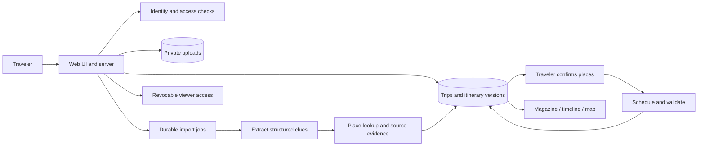

# Proposed architecture

Keep one web application and one job runner only where long-running work needs it.
Use a familiar framework chosen at kickoff. Modules below are code ownership boundaries,
not a requirement for microservices or independently published packages.

| Area | Location | Boundary |
| --- | --- | --- |
| UI | apps/web/src/features | Display saved state; confirmation and edits |
| Server | apps/web/src/server | Identity, authorization, persistence, provider calls |
| Job process | apps/worker | Bounded retry, job progress, durable results |
| AI | packages/ai | Extract candidates; preserve provenance; validate model output |
| Planner | packages/planner | Deterministic constraint checks and schedule revisions |
| Shared shapes | packages/contracts | Versioned requests, responses, states, fixtures |
| Persistence | database | Migrations, access rules, non-private seed data |

Private source assets stay separate from public share projections.
The planner consumes confirmed place data and explicit unknowns.
All UI representations consume one persisted itinerary version.
Provider/model adapters allow evaluation without rewriting the product.

Before implementation, Member 4 and Member 3 record stack alternatives and the deployment
topology in planning/decisions.md. Member 3 verifies provider capabilities, terms and current costs.

## Implemented base (2026-09-14)

The boundaries above exist as runnable code with development stand-ins: one Next.js app serves UI and API,
`apps/worker` only triggers due jobs, and every module shares `packages/contracts`.
How the pieces connect and what each owner replaces: [feature specs](features/README.md).
Every operation: [API reference](api/endpoints.md).
