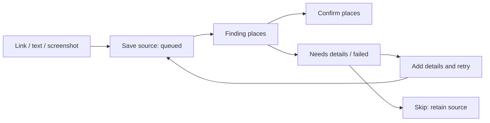
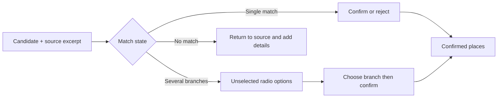
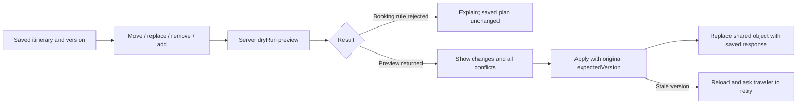

# Reel Travel frontend design plan

Date: 15 September 2026. Task: FE01. Owner: Member 1; reviewer: Member 2.
Status: proposed direction, pending human review. This document and the generated concepts are design artifacts; no application behavior changed and no usability results have been measured.

## 1. Direction: an editable travel journal

Make the transformation from a saved idea to a usable day easy to follow: **Save → Confirm → Set up → Plan → Share**. Use an editorial travel aesthetic for the magazine and a clear, compact interface for decisions and edits.

The existing cream, ink and blue palette is the starting point. Keep Reel Travel as the working name. Use Tokyo as the **proposed** pilot destination because the repository already has synthetic Tokyo fixtures; this is not an approved pilot-city decision. All concept venues, dates and bookings are illustrative.

The core promise to communicate is traceable place suggestions and edits that respect fixed bookings. Do not describe that promise as a measured advantage.

### Existing foundation

- The [handover](../handover.md) describes a working development base; [scope](../product/scope.md) still contains the older statement that nothing is implemented. Treat its stories as requirements and the handover/code as the current implementation baseline.
- Existing routes, typed API client, shared itinerary object, fixture states and UI primitives can be reused.
- The current itinerary screen exposes move/remove/add, but not the contract's `replace_stop` or `dryRun` preview.
- The current magazine filters out breaks and omits explicit travel rows. Its redesign should retain the day's sequence, breaks, travel estimates, fixed bookings and uncertainty. This is planned work, not an implemented fix.
- Real providers, auth, storage and hosting remain separate backend work. A visual redesign must not imply they are finished.

## 2. Screen map

| Route / screen | Main purpose and primary action | Layout and important states |
| --- | --- | --- |
| `/` Landing | Explain the workflow; **Start a trip** | Editorial trip preview, three workflow steps, truthful development/demo copy. Proposed pricing clearly identified as a hypothesis; no working subscription controls. |
| `/sign-in` | Resume personal trips | Focused form; loading, invalid input and session errors. Keep development sign-in visibly identified until real auth is connected. |
| `/trips` | Choose or create a trip | Compact trip cards: destination, dates, timezone. Empty state with **Create trip**. Do not invent readiness counts absent from the response. |
| `/trips/:tripId/inbox` | Capture and recover ideas | Link/text/screenshot composer, saved items with source and status. Recovery inline; **Save inspiration**. |
| `/trips/:tripId/places` | Resolve suggested places | Evidence cards and map; ambiguous groups first. **Confirm selected** only after explicit branch selection. |
| `/trips/:tripId/setup` | Establish constraints | Three sections: trip details, preferences, fixed bookings. Explicit section saves and inline validation; no hidden autosave. |
| `/trips/:tripId/itinerary` | Generate and edit days | Day selector, validation summary, Timeline/Map/Magazine tabs, unscheduled places. **Generate itinerary**, then **Regenerate**. |
| `/trips/:tripId/share` | Manage viewing access | **Create viewing link**, one-time copy panel, active/revoked list. |
| `/s/:token` | Read the shared trip | Magazine initially, with Timeline/Map available; read-only label, current version, loading/missing/revoked states. |

Trip creation collects destination, dates and timezone before opening the inbox. Setup remains accessible throughout the journey. The product targets three-to-seven-day trips; current contracts allow shorter trips up to seven days. Do not silently introduce a new minimum without a contract/product decision.

## 3. Three workflow sketches

These sketches specify behavior; image concepts supply visual direction. Exact state rules remain in the feature specs.

### A. Save and recover — FE02 / F1

Composer at the top, latest saves below. A source card contains type, original text/link or owner-only image, status and a next action. Offer an upload preview and the existing 5 MB size/type guidance. Show indeterminate processing text rather than invented progress percentages. Preserve input on request failure and suppress duplicate submits.

Recovery copy: “We couldn't read this link. Your save is safe.” Follow it with the actual failure reason and a labeled place-name/caption field. Retry/add-details are available only for `needs_input` or `failed`; Skip is also allowed while queued, but not processing. Poll only while work is queued/processing, retaining the current 1.5-second pattern.

### B. Confirm a branch with evidence — FE04 / F2

Use a roughly 60/40 list/map split on wide screens; list/map toggle on phones. Each option has its available address, category, provider attribution and unknown fields. If no excerpt exists, show source type and clue, not an invented quote. Map markers and list items share selection, numbered labels and accessible names. Branch selection changes only local selection until Confirm succeeds.

After duplicate merging, refresh the list and keep all source evidence accessible. “Confirmed” means the traveler selected the match; it does not mean opening hours were verified. Use text labels alongside the existing confirmed/pending/branch colors. Never display a fabricated confidence percentage.

### C. Edit around a fixed booking — FE09 / F4

Start with a Move menu and explicit day/position controls usable by touch and keyboard. Add drag and drop only after these controls work. A move/replace sheet shows original and proposed times, affected day, estimates, and the fixed booking. Label a preview **Not saved**; Apply sends `dryRun: false` with the original saved version, never a version suggested by the preview. Cancel preserves the saved object.

The server is authoritative. The current policy rejects booking edits and edits that newly make a locked booking unreachable. Other conflicts can be saved and must remain visible: do not invent a rule that every conflict blocks saving. Clearly label a saved result with conflicts. A preview is not a guarantee: revalidate on Apply. Disable duplicate apply actions and ignore obsolete preview responses after a new selection.

Bookings have a lock label and no itinerary edit controls. Return to Setup to manage the booking itself. On `STALE_VERSION`, reload the latest plan, discard the outdated preview and explain the retry. Changes to setup/places show a separate “Trip inputs changed” banner until regeneration.

## 4. Visual system

Proposed tokens extend the existing [global CSS](../../apps/web/src/app/globals.css); they are not yet applied.

| Role | Proposed value | Use |
| --- | --- | --- |
| Canvas / surface | `#f7f6f3` / `#ffffff` | Warm page and white interactive surfaces |
| Main / secondary text | `#1c1917` / `#57534e` | Headings/body and readable secondary labels |
| Primary / on-primary | `#1d4ed8` / `#ffffff` | One dominant action and active navigation |
| Border | `#e7e5e4` | Decorative dividers; controls need a stronger boundary where necessary |
| Success | `#15803d` | Traveler-confirmed states, with text/icon |
| Warning | `#b45309` | Unknowns and partial checks, with text/icon |
| Error | `#b91c1c` | Failed actions and blocking conflicts, with explanation |
| Type | Existing system sans; Georgia serif for editorial headings | No external font dependency required |
| Scale | Body 16px; metadata 14px; section 24px; page 32px; editorial 40–56px | Responsive headings; reserve uppercase for short optional kickers |
| Spacing | 4, 8, 12, 16, 24, 32, 48px | 16px mobile gutters; 24–32px desktop |
| Shape | Cards 12px; controls 8px; badges compact | Fine borders; shadows only for elevated menus/sheets |

Use a typographic wordmark initially. A final logo and name alternatives belong to FE07/M14. Decorative destination images can give the magazine personality, but never substitute for source evidence or factual venue photographs. The current contracts have no venue/cover image field: first implementation may use a typography-only cover or a bundled explicitly illustrative asset. New persisted imagery requires a separate contract decision. Never publish private screenshot previews as public trip covers.

## 5. Responsive composition and interaction

- **Wide, 1200px and above:** 200–220px trip sidebar, flexible content region capped around 1440px overall; optional secondary map beside the timeline. Both map and timeline receive the same itinerary/day selection.
- **Medium, 768–1199px:** compact header and trip navigation; one main pane with map as a tab. Avoid squeezing a three-column desktop composition into a tablet.
- **Small, below 768px:** 16px gutters, single column, bottom navigation for Inbox / Places / Setup / Itinerary. Share remains a labeled header action. Respect safe-area insets and reserve enough bottom padding so navigation never covers actions.
- Keep itinerary view tabs separate from trip navigation. Use a labeled day selector on narrow screens and tabs on wide screens. Preserve selected day across view changes; clamp selection if trip dates change.
- Show plan version and validation status in every view. Map lines represent estimated connections, not turn-by-turn routing. Keep map attribution visible. Missing-location stops remain in the list with “Location unavailable”.
- Magazine uses a deterministic day template with time, place, breaks, estimated travel and booking labels. Editorial styling must not hide unknown hours or reorder stops.
- Keep empty/loading/error states inside their relevant region. Loading a map must not block the list. Announce saved, recovered and rejected actions without moving focus unexpectedly.
- Design target: at least 44px touch controls, visible keyboard focus, labeled icons, logical headings, a skip link, and non-color status cues. Target text contrast 4.5:1 and control/focus contrast 3:1; measure actual pairings during implementation. These are targets, not a compliance claim.
- Dialog/sheet implementation needs initial focus, focus containment, Escape to close where safe, focus restoration and scroll management. Respect reduced motion; transitions should be brief and optional.

## 6. Shared components and data boundaries

Extend [ui.tsx](../../apps/web/src/components/ui.tsx) instead of creating a second primitive system. Agree props between Members 1 and 2 before building feature screens.

| Shared unit | Responsibilities | Consumer / existing anchor |
| --- | --- | --- |
| `TripShell` / `TripNavigation` | Responsive navigation, trip title, active route | `features/trips/TripHeader.tsx` and trip layout |
| Button, Field, Tabs, Badge | States, labels, focus, validation semantics | `components/ui.tsx` |
| Empty, Loading, ErrorBanner | Region-level feedback and meaningful recovery | Existing UI primitives |
| `SourceEvidence` | Clue, excerpt/type, source reference, expanded evidence | Inbox/places owner UI only |
| `ValidationSummary` | Status, conflicts, affected stops and suggestions | `ConflictList.tsx`, all itinerary views |
| `DaySelector`, `StopCard`, `BookingLabel` | Stable stop identity, estimated travel, lock/unknown labels | Timeline and magazine |
| `EditStopSheet` | Local edit draft, dry-run preview, Apply/Cancel | Itinerary owner screen only |
| `ShareLinkPanel` | Create/copy success, one-time URL, revoke state | Owner sharing page |

Feature hooks use [api-client.ts](../../apps/web/src/lib/api-client.ts) and the existing [API registry](../../packages/contracts/src/api.ts). Keep domain rules in services and `packages/planner`. Never connect UI directly to the development file store.

The owner itinerary page loads and owns one saved itinerary. Pass it to Timeline, Map and Magazine; replace it only with a successful server save. Keep local preview state separate. Owner-only source data stays outside the public view components; the shared page uses `shared.get` and `PublicItinerary`. An existing viewing link cannot be copied again after its creation response is lost because `shares.list` does not return tokens; show creation-time Copy/Open and explain “Copy this link now.” Do not store tokens for convenience or promise expiry.

The proposed first pass fits existing endpoints. Client day selection, filters, navigation and modal state need no API changes. If implementation introduces new response fields, start in `packages/contracts/src/api.ts`, coordinate schema changes and run typecheck plus API documentation generation as required by the feature guide.

## 7. Delivery sequence and acceptance

Sequence is proposed; existing task owners, points and deadlines remain authoritative. Several deadlines are already due; this is not a claim that the remaining work fits them.

| Slice / task | Concrete work | Acceptance to record when implemented |
| --- | --- | --- |
| 1 — FE01 | Review concepts, choose pilot city, agree tokens and component props | Member 2 records review; Member 1 confirms direction. Proposal remains open until then. |
| 2 — FE02 / FE04 / FE05 | Shell and primitives; capture/recovery; branch confirmation; setup | Save keeps source through failure/retry/skip; no preselected branch; merged evidence survives; setup persists and shows stale state. |
| 3 — FE09 | Timeline, unscheduled places, accessible move/replace, preview/conflicts | Preview creates no persisted version; Cancel preserves plan; dinner stays fixed; rejected and stale edits explained; successful edits use returned version. |
| 4 — FE10 / FE11 | Deterministic magazine, map integration, sharing | Same version/order across views, breaks/estimates/unknowns visible; private viewer has no owner controls/data; revoked link fails on next request. |
| 5 — FE03 / FE07 | Landing and visual brand polish using working screens | CTA event fires; sample imagery and proposed pricing accurately labeled; no unsupported product claims. |
| 6 — FE12 / FE14 / FE06 | Core-flow browser check; phone/keyboard pass; observed pilot | Run below checks; record actual results and fix the largest observed blocker. |

### Browser acceptance scenarios (planned, not run)

1. At 400px width, create a trip, save an inaccessible link, recover it with details, and find its retained source. Also check screenshot upload size/type errors and input preservation.
2. Open an ambiguous fixture: neither option selected; choosing a radio enables confirmation; duplicate merge retains both sources. Check keyboard and map/list selection.
3. Generate the seeded trip; check the 19:30–21:00 locked dinner and unknown-hours labels. Preview a move, cancel, then apply a valid move. Test rejected booking conflicts and an old expected version.
4. Switch Timeline → Map → Magazine after the edit. Confirm same version, stop ordering, booking time, breaks, travel estimates and uncertainty; check unscheduled places remain available.
5. Create a viewing link; copy it on creation; open in a private window. Confirm read-only access and no private uploads/evidence; revoke and reload.
6. Repeat critical actions by keyboard; inspect 400px and desktop layouts, long titles, zoom, reduced motion, contrast and focus. Test list use when map loading fails.
7. Observe a traveler completing the core demo: record completion, time, recovery attempts and misunderstood labels. No participant findings or timing numbers exist yet.

At implementation handoff run the relevant acceptance checks and `npm run check`; run `npm run smoke` against a running app and the browser core-flow check for changed behavior. Keep sanitized running-app captures in `deliverables/evidence/`. Generated design concepts do not count as implementation or usability evidence.

## 8. Review and artifact record

- Human approval: pending. Pilot city: Tokyo proposed, not confirmed. Brand name: working title. Final logo: not designed.
- Image generation: built-in imagegen tool; exact prompts are in [imagegen-prompts.md](imagegen-prompts.md).
- Repository work in this task: design documentation, concept images and planning traceability only.
- Verification: see [README](README.md) for the checks actually completed for this design handoff.

