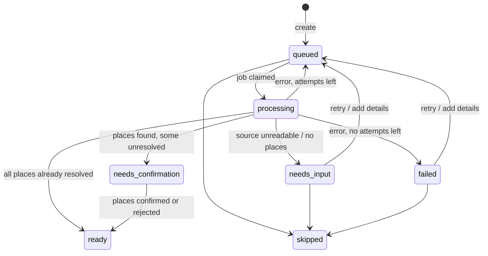

# F1 Import: save inspiration and recover failures

**Story US-01 acceptance:** every save retains source and status; failure offers add details, retry or skip.
**Owners:** UI Member 1 (FE02) · extraction and import Member 3 (BE02, BE04) · jobs, uploads and deployment Member 4 (BE10, BE11)
**Screen:** `/inspiration-library` (country albums), `?country=JP` (category/city gallery), `?trip=:tripId` (trip-scoped gallery) · code in `apps/web/src/features/library` and `apps/web/src/features/inbox`

## User flow

Home also offers a reference-styled save composer. It hides the trip selector and preserves the existing default (earliest upcoming/draft trip, otherwise most recently updated trip), then names the destination trip in the success message. The library retains its trip picker. Saving without a trip and AI trip assignment remain future work. [Home implementation and isolated browser checks](../../deliverables/evidence/home-2026-09-16/README.md).

1. The traveler selects **Add inspiration**, pastes text, a link or a screenshot (optional note) and saves it to a trip. The country's collection opens.
2. The save appears at once as **Queued**, then **Finding places…**. The list polls every 1.5 s while any save is queued or processing.
3. It ends in one of:
   - **Confirm places**: candidates were found. Link to the Places screen.
   - **Done**: every place it produced is confirmed or rejected.
   - **Needs details**: the source couldn't be read. The traveler types names/caption → re-queued.
   - **Failed**: extraction kept erroring. Retry, add details, or skip.
4. **Skip** stops trying but keeps the original save.

The library opens source details and recovery controls in a modal drawer. Countries use trip destinations and a temporary exact-name lookup; categories use existing place matches. Grouping is not confirmation or a real AI-provider implementation. [Country album behavior and limits](../design/library-country-albums.md), [recorded verification](../../deliverables/evidence/M17-2026-09-16-library.md).

## Endpoints

| UI action | Endpoint | Notes |
| --- | --- | --- |
| Load and poll the list | `inspirations.list` | Newest first. |
| Save text or link | `inspirations.create` | `201 { inspiration, job }`. The job starts after the response. |
| Save screenshot | `inspirations.createFromScreenshot` | multipart `file` (png/jpeg/webp/gif, ≤ 5 MB) + `note`. `413` if too large. |
| Show one save with its places | `inspirations.get` | Includes latest job (attempt, lastError). |
| Retry | `inspirations.retry` | Only `needs_input` or `failed`, else `409 INVALID_STATE`. |
| Add details and retry | `inspirations.addDetails` | Appends to `details` and re-queues. Same states as retry. |
| Skip | `inspirations.skip` | Only `queued`, `needs_input`, `failed`. |
| Show screenshot | `uploads.get` | ``. Owner only. |
| Run retries (worker/cron) | `jobs.runDue` | `x-worker-secret` header. |

## States

`failureCode` tells the UI why: `SOURCE_INACCESSIBLE`, `UNSUPPORTED_SOURCE`, `IMAGE_UNREADABLE`, `NO_PLACES_FOUND`,
`EXTRACTION_ERROR`, `LOOKUP_ERROR`. Show `failureMessage` to the traveler.

## Server rules

- The save row is written **before** extraction. A crash or failed job never loses it.
- Pipeline in [import-inspiration.ts](../../apps/web/src/server/jobs/import-inspiration.ts):
  extractor → validate clues with `ClueListSchema` → place lookup per clue → `upsertCandidate` with evidence.
- Idempotent: re-running a save adds no duplicate places or evidence (evidence key = save id + clue).
  A clue that resolves to an existing place adds evidence to it instead of creating a duplicate.
- Jobs: 3 attempts, retry after 10 s then 60 s. A job stuck in `running` for 5 minutes can be claimed again.
  In development the job runs right after the response; `npm run worker` or a cron calling `jobs.runDue` handles retries.
- Save content is data, not instructions. Never let text in a save change prompts, tools or validation.
- Analytics: `import_started`, `import_completed`, `import_recovered` (ids and counts only).

## What the base does, and what to replace

| Piece | Now | Replace with | Owner |
| --- | --- | --- | --- |
| `Extractor` | [fake-extractor.ts](../../packages/ai/src/fake-extractor.ts): matches fixture names, never fetches links or reads images | Model adapter (text + vision) returning `PlaceClue[]` or `needs_input` | Member 3 (BE02) |
| Link reading | Always `SOURCE_INACCESSIBLE` without a note | Whatever DEC-05 finds is permitted; otherwise keep the recovery path | Member 3 (BE01) |
| Provider selection | `AI_PROVIDER=fake` | Add a case in [providers.ts](../../apps/web/src/server/providers.ts) | Member 3 |
| Job runner | In-process `after()` + optional worker polling | Hosting-appropriate cron/queue calling `jobs.runDue` | Member 4 (BE11) |
| Inbox UI | Functional forms and cards | Designed inbox, upload preview, progress | Member 1 (FE02) |

## Fixtures

`inspirationFixtures.processing`, `.ready`, `.needsConfirmation`, `.inaccessibleLink`, `.failed` in
[fixtures](../../packages/contracts/fixtures/index.ts). `npm run seed` creates a trip with an unreadable Instagram link.

## Acceptance checks

- [ ] A text save shows queued → processing → confirm places without reloading.
- [ ] An Instagram link shows "Needs details"; adding "light museum" recovers it; the original URL is still shown.
- [ ] A save with `[[fail]]` ends as Failed after 3 attempts with the text intact; adding details recovers it with no duplicate places (integration test "import").
- [ ] Skip keeps the save visible as Skipped.
- [ ] A screenshot is visible to its owner; another account gets `404` from `uploads.get`.
- [ ] Malformed extractor output is rejected and retried, never saved (BE02).
- [ ] Embedded instructions in a save don't change extraction behaviour (tests/README "AI input").

## BE01 audio sample boundary

A separate [manual audio runner](../../packages/ai/README.md#phase-1-local-audio-sample-be01) now exercises
transcription and structured extraction. It does not change these endpoints, screenshot handling, job states,
provider selection or source enums. Web audio import requires a later contract change; BE02/BE04 remain separate.

## Real provider integration (2026-09-16)

`AI_PROVIDER=openai` accepts text and reuses Gemini for supported YouTube links without supplied recovery text. All clues pass ClueListSchema and literal excerpt validation. Empty clues request more input; malformed output throws for existing job retries. Screenshots remain text-recovery only. [Setup](../operations/google-places.md).

## YouTube classification experiment (2026-09-21)

Separate [analysis command](../operations/youtube-reels.md) produces speech/visual evidence and
itinerary/place JSON. No endpoint, existing import job, source enum or place-confirmation change.
Offline acceptance checks cover output shapes, silent visual input, fallback, citation validation,
provider failure handling and optional output files. Live classification accuracy remains pending.
[Implementation evidence](../../deliverables/evidence/be01-reels-2026-09-21.md).
