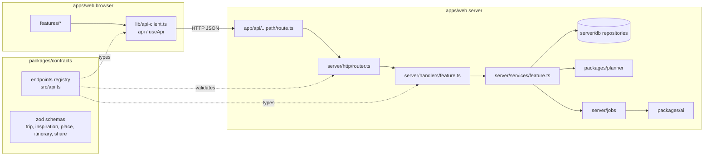

# Feature specs

Each spec says what the feature must do, which screen calls which endpoint, which states the UI must handle,
what the app base already does, what each owner replaces, and how to check it is done.
Exact request and response shapes are in the generated [API reference](../api/endpoints.md). This folder explains behaviour.

| Spec | Story | Screen | Endpoints | UI | Server | What the base does now |
| --- | --- | --- | --- | --- | --- | --- |
| [F0 Foundation](F0-foundation.md) | Sign-in, isolation | `/sign-in` | `auth.*` | Member 1 | Member 4 | Dev email sign-in, JSON file store |
| [F1 Import](F1-import.md) | US-01 | `/trips/:tripId/inbox` | `inspirations.*`, `uploads.get`, `jobs.runDue` | Member 1 | Member 3 + Member 4 | Fake extractor, durable jobs |
| [F2 Places](F2-places.md) | US-02 | `/trips/:tripId/places` | `places.*` | Member 1 | Member 3 | Fixture lookup, merge on confirm |
| [F3 Trip setup](F3-trip-setup.md) | US-03 | `/trips`, `/trips/:tripId/setup` | `trips.*`, `reservations.*` | Member 1 | Member 4 | Working |
| [F4 Itinerary](F4-itinerary.md) | US-04, US-05 | `/trips/:tripId/itinerary` | `itinerary.*` | Member 2 | Member 4 | Greedy baseline planner |
| [F5 Views](F5-views.md) | US-06 | Itinerary tabs, `/s/:token` | `itinerary.get`, `shared.get` | Member 2 | Member 4 | Plain timeline, map, magazine |
| [F6 Sharing](F6-sharing.md) | US-07 | `/trips/:tripId/share`, `/s/:token` | `shares.*`, `shared.get` | Member 2 | Member 4 | Working; no rate limit |

Everything in the base runs end to end today with synthetic data. "Fake" and "baseline" parts are marked in
code and in each spec; replace them behind the same interface so the other side keeps working.

## How the frontend and backend connect

1. **Contract.** One entry per endpoint in [api.ts](../../packages/contracts/src/api.ts): method, path, access,
   owners, params, query, body and response schemas, and domain errors.
2. **Server.** Every `/api/*` request goes to [router.ts](../../apps/web/src/server/http/router.ts), which matches the
   entry, checks the session, validates input, calls the handler with the same id and validates the output.
   Handlers are thin. Rules live in `server/services`, the planner package and the AI package.
3. **Browser.** Call `api("trips.get", { params: { tripId } })` or `useApi(...)`. The id decides the URL, the method,
   what you must send and what you get back.
4. **Mismatches fail early.** A handler returning the wrong shape or a screen sending the wrong body is a type error.
   A response that slips past types (e.g. a missing field at runtime) returns `CONTRACT_VIOLATION` in development.
   The response schema also strips fields not in the contract, so private columns never leak by accident.

## Working in parallel

- **UI first:** the base endpoints already work with the fake extractor, fixture places and baseline planner.
  Run `npm run seed` for a trip in every state. For states that are awkward to reach, render components with
  `@reel/contracts/fixtures`.
- **Server first:** prove behaviour with a service-level test (see [core-flow.test.ts](../../tests/integration/core-flow.test.ts))
  or `npm run smoke` against the running app. You don't need a screen to finish a server task.
- **Fake markers:** in the fake extractor, a save containing `[[fail]]` throws until details are added. Links and
  screenshots always need details. `"Quoted names"` that match nothing become "no match" places.

## Changing a contract

A contract change affects two owners. In the same PR:

1. Edit the schema or the endpoint entry in `packages/contracts/src`.
2. Run `npm run typecheck`. Every handler, service and screen that no longer fits is listed.
3. Fix the server side and the UI side, or pair with the other owner.
4. Update fixtures if a state changed (`packages/contracts/fixtures`), then run `npm test`.
5. Run `npm run docs:api` and commit the regenerated reference.
6. Mention the change in the PR title (e.g. `contract: add budget to Trip`) and request review from the other owner.

Prefer adding optional fields over renaming or removing existing ones while others are building on them.

## Definition of done for any feature task

- Behaviour matches the spec's acceptance checks, reproduced by the assigned reviewer.
- A test or a recorded manual check exists for each acceptance check; record what actually ran.
- `npm run check` passes (types, tests, API docs up to date, planning validation).
- No provider keys in the browser, no private uploads or real traveler data committed.
- Evidence and the relevant milestone answer are updated ([milestones](../../deliverables/milestones/README.md)).
